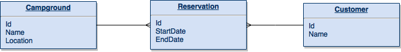
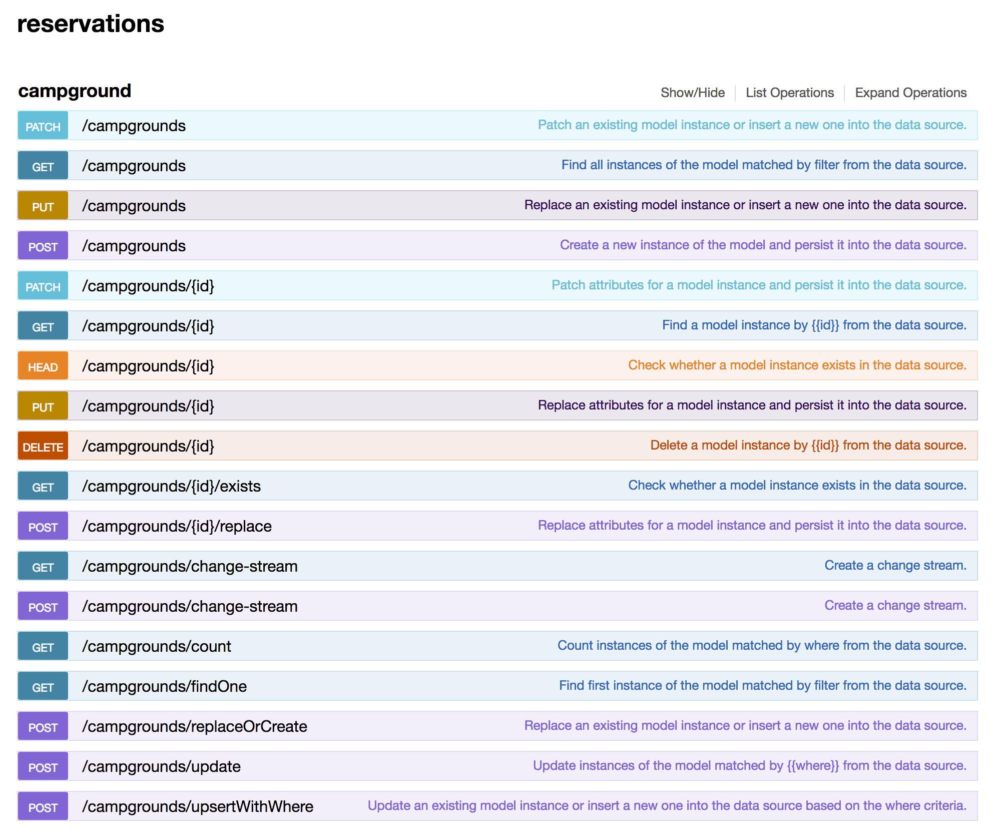
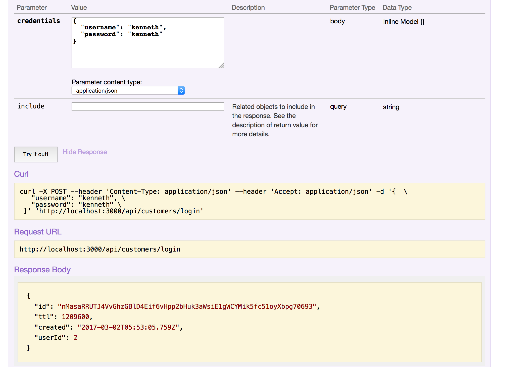
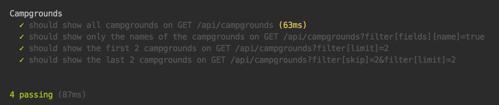
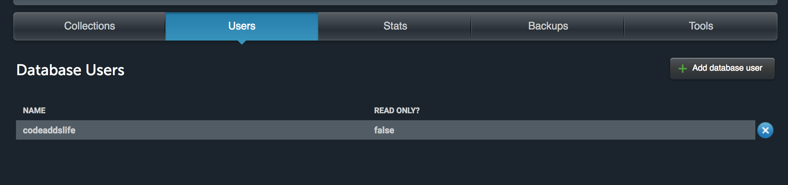

# Developing a complete REST API with Loopback
[Loopback](http://loopback.io) was created as an open source mobile backend-as-a-service framework by 
[Strongloop](http://strongloop.com). It allows you to setup a REST API in minutes and is based on 
[Express]((http://expressjs.com)). 

Here we will use version 3.4.0 to build an API for camping reservations:



## Getting Started
Loopback comes with a [CLI tool](https://loopback.io/doc/en/lb3/Command-line-tools.html) to generate an application. 
You can configure everything manually, but the CLI tool is just a really handy gift to get you started. Install it via 
the node package manager: `npm install -g loopback-cli`

When installed, type `lb to start the [yeoman-generator](http://yeoman.io):

```
     _-----_     
    |       |    ╭──────────────────────────╮
    |--(o)--|    │  Let's create a LoopBack │
   `---------´   │       application!       │
    ( _´U`_ )    ╰──────────────────────────╯
    /___A___\   /
     |  ~  |     
   __'.___.'__   
 ´   `  |° ´ Y ` 

? What's the name of your application? reservations
? Enter name of the directory to contain the project: reservations
   create reservations/
     info change the working directory to reservations

? Which version of LoopBack would you like to use? 3.x (current)
? What kind of application do you have in mind? empty-server (An empty LoopBack API, without any configured models or datasources)
```

When finished, you will see the following project structure. The JSON files are for configuration and the Javascript 
files are for extending Express.


```
reservations/ 
├── client                       # Client JS, HTML and CSS files
│ └── README.md                  # Empty README.md file
├── package.json                 # Npm package specification
└── server                       # Node scripts and config 
 ├── boot                        # Initialization scripts
 │ └── root.js                   # Specify the contextroot
 ├── component-config.json       # Loopback components config
 ├── config.json                 # Global settings
 ├── datasources.json            # Datasource config
 ├── middleware.development.json # Middleware config for dev
 ├── middleware.json             # Middleware config
 ├── model-config.json           # Binds models to datasources
 └── server.js                   # Main application script
```

Go to the reservations folder and start the application by running npm start. Open http://localhost:3000/explorer in
your browser to see a basic [Swagger-UI](http://swagger.io/swagger-ui/)

## Persistence
Look at server/datasources.json. We have no datasources configured yet. We will use an in-memory database here, 
but there are many [database connectors available](https://loopback.io/doc/en/lb3/Database-connectors.html) out-of-the-box. 

Type lb datasource to start the generator again.

```
? Enter the data-source name: reservationDS
? Select the connector for reservationDS: In-memory db (supported by StrongLoop)
Connector-specific configuration:
? window.localStorage key to use for persistence (browser only): 
? Full path to file for persistence (server only): db.json
```

The db.json file will persist the in-memory data to a file. This allows us to keep our data when we restart the server. 
It also allows us to start our application with some test data. 

We will create this file later on. Loopback won't give any warning when this file is not available yet. 

## Models
Loopback is designed around the concept of [models](https://loopback.io/doc/en/lb3/Defining-models.html). Let's create a model for our campground, `lb model`

```
? Enter the model name: campground
? Select the data-source to attach campground to: reservationDS (memory)
? Select model's base class PersistedModel
? Expose campground via the REST API? Yes
? Custom plural form (used to build REST URL): 
? Common model or server only? server
Let's add some campground properties now.

Enter an empty property name when done.
? Property name: name
   invoke   loopback:property
? Property type: string
? Required? Yes
? Default value[leave blank for none]: 

Let's add another campground property.
Enter an empty property name when done.
? Property name: location
   invoke   loopback:property
? Property type: geopoint
? Required? No
? Default value[leave blank for none]: 

Let's add another campground property.
Enter an empty property name when done.
? Property name: 
```

We created the campground model and derived it from the PersistedModel, so we can save it to our 
datasource. You can make a model common, which means that the same model can be shared between the client and the 
server, but we decided to use it for the server only. 

Our model has 2 properties, a name and a location. 
The id property is automatically included, so you don’t have to add it. 

Visit the API explorer at http://localhost:3000/explorer. You'll see a lot of endpoints available for our 
campgrounds now.  



Let's test our API by getting all the campgrounds:

```
curl -X GET 'http://localhost:3000/api/campgrounds'
```

Since we don't have any data, the response will be an empty list. We now create the db.json file that we specified in 
the previous section. Create a db.json file at the root of the project. 

```
{
  "ids": {
    "campground": 5
  },
  "models": {
     "campground": {
       "1": "{\"name\":\"Salt Lake City KOA\",\"location\":{\"lat\": 40.772112, \"lng\": -111.932165},\"id\":1}",
       "2": "{\"name\":\"Gouldings Campground\",\"location\":{\"lat\": 37.006989, \"lng\": -110.214907},\"id\":2}",
       "3": "{\"name\":\"Grand Canyon Mather Campground\",\"location\":{\"lat\": 36.056472, \"lng\": -112.140728},\"id\":3}",
       "4": "{\"name\":\"Camping Paris Bois de Boulogne\",\"location\":{\"lat\": 48.868879, \"lng\": 2.234914},\"id\":4}"
     }
  }
}
```

Restart the server and try again. You should now see 4 campgrounds.
We will finish this part by generating our reservation model, lb model:

```
? Enter the model name: reservation
? Select the data-source to attach reservation to: reservationDS (memory)
? Select model's base class PersistedModel
? Expose reservation via the REST API? Yes
? Custom plural form (used to build REST URL): 
? Common model or server only? server
Let's add some reservation properties now.

Enter an empty property name when done.
? Property name: startDate
   invoke   loopback:property
? Property type: date
? Required? Yes
? Default value[leave blank for none]: 

Let's add another reservation property.
Enter an empty property name when done.
? Property name: endDate
   invoke   loopback:property
? Property type: date
? Required? Yes
? Default value[leave blank for none]: 

Let's add another reservation property.
Enter an empty property name when done.
? Property name: 
```

## Relations
Campgrounds can have zero or more reservations. We have to create a 
[relationship between our models](https://loopback.io/doc/en/lb3/Define-model-relations.html) to accomplish this, `lb 
relation`:

```
? Select the model to create the relationship from: campground
? Relation type: has many
? Choose a model to create a relationship with: reservation
? Enter the property name for the relation: reservations
? Optionally enter a custom foreign key: 
? Require a through model? No
```

Start the server again and go to the API Explorer. You will see some new endpoints for /campgrounds/{id}/reservations. 

Let’s update our test data so we have a couple of reservations for our campgrounds.

````
{
  "ids": {
    "campground": 5,
    "reservation": 3
  },
  "models": {
     "campground": {
       "1": "{\"name\":\"Salt Lake City KOA\",\"location\":{\"lat\": 40.772112, \"lng\": -111.932165},\"id\":1}",
       "2": "{\"name\":\"Gouldings Campground\",\"location\":{\"lat\": 37.006989, \"lng\": -110.214907},\"id\":2}",
       "3": "{\"name\":\"Grand Canyon Mather Campground\",\"location\":{\"lat\": 36.056472, \"lng\": -112.140728},\"id\":3}",
       "4": "{\"name\":\"Camping Paris Bois de Boulogne\",\"location\":{\"lat\": 48.868879, \"lng\": 2.234914},\"id\":4}"
     },
     "reservation": {
       "1": "{\"startDate\":\"2017-03-21\",\"endDate\":\"2017-03-23\",\"campgroundId\":1,\"id\":1}",
       "2": "{\"startDate\":\"2017-03-25\",\"endDate\":\"2017-03-31\",\"campgroundId\":2,\"id\":2}"
     }
  }
}
````

## Queries
Loopback endpoints can also be used to [query specific data](https://loopback.io/doc/en/lb3/Querying-data.html). 
Here’s a selection of what is possible out of the box:

- Show all campgrounds with ’KOA’ in there name  
  `/api/campgrounds?filter[where][name][like]=KOA`

- Show all reservations after or on 2017–03–22  
  `/api/reservations?filter[where][startDate][gte]=2017-03-22`

- Show only the names of the campgrounds:  
  `/api/campgrounds?filter[fields][name]=true`

- Show everything but the names of the campgrounds:  
  `/api/campgrounds?filter[fields][name]`

- Show campgrounds and include their reservations:  
  `/api/campgrounds?filter[include][reservations]`

- Show the first 2 campgrounds:  
  `/api/campgrounds?filter[limit]=2`

- Show the next 2 campgrounds:  
  `/api/campgrounds?filter[skip]=2&filter[limit]=2`

- Order campgrounds by name  
  `/api/campgrounds?filter[order]=name`

- Descending order campgrounds by name:  
  `/api/campgrounds?filter[order]=name%20DESC`

## Geolocation
You can also query based on geolocation. The location of our campground is a 
[geopoint](https://loopback.io/doc/en/lb3/Geotype.html).   
Imagine we are at Arches Nation Park and we want to search for all campgrounds within a 200 mile radius:

```
/api/campgrounds?filter[where][location][near]=38.7006538,-109.5643742&filter[where][location][maxDistance]=200
```

## Validation
When we created the campground model, we made the name required. If we try to create a campground without a name, 
loopback will give us a validation error saying that the field cannot be blank. 

Loopback also has some built-in 
[validation methods](https://loopback.io/doc/en/lb2/Validating-model-data.html#using-validation-methods) for frequently 
used validation. The name of our campground should have max. 100 characters. We can implement this by adding the 
following code to server/models/campground.js:

```
'use strict';

module.exports = function(Campground) {
 Campground.validatesLengthOf('name', {max: 100, message: {max: 'Name is too long'}});
};
``` 

You can also add custom validation. For a reservation, the endDate should be after the startDate:

```
'use strict';

module.exports = function(Reservation) {
  Reservation.validate('startDate', dateValidator, {message: 'endDate should be after startDate'});
    function dateValidator(err) {
      if(this.startDate >= this.endDate) {
        err();
      }
    }
};
```

## Security
All our endpoints are public. We should add some security here. Our example will have 3 types of users. Anonymous 
users should be able to see all campgrounds. When they register, they will become customers who can make reservations 
and can see only there own reservations. 

Administrators should be able to see and do anything. Loopback has 
[built-in models](http://loopback.io/doc/en/lb3/Using-built-in-models.html) for security, but it is advised not to use 
them directly. We will create a customer model that extends from the User model. `lb model`:

```
? Enter the model name: customer
? Select the data-source to attach customer to: reservationDS (memory)
? Select model's base class User
? Expose customer via the REST API? Yes
? Custom plural form (used to build REST URL): 
? Common model or server only? server
Let's add some customer properties now.

Enter an empty property name when done.
? Property name: name
   invoke   loopback:property
? Property type: string
? Required? No
? Default value[leave blank for none]: 

Let's add another customer property.
Enter an empty property name when done.
? Property name: 
```

Customers can have zero or more reservations. Let's create a relation here, `lb relation`:

```
? Select the model to create the relationship from: customer
? Relation type: has many
? Choose a model to create a relationship with: reservation
? Enter the property name for the relation: reservations
? Optionally enter a custom foreign key: 
? Require a through model? No
```

Since we started from an empty server, the built-in models are not defined in server/model-config.json. Let's add those 
now. 

Setting the 'public' property to false means that they will not be public and will not be shown in our API explorer.

```
{
  "_meta": {
    "sources": [
      "loopback/common/models",
      "loopback/server/models",
      "../common/models",
      "./models"
    ],
    "mixins": [
      "loopback/common/mixins",
      "loopback/server/mixins",
      "../common/mixins",
      "./mixins"
    ]
  },
  "campground": {
    "dataSource": "reservationDS",
    "public": true
  },
  "reservation": {
    "dataSource": "reservationDS",
    "public": true
  },
  "customer": {
    "dataSource": "reservationDS",
    "public": true
  },
  "User": {
    "dataSource": "reservationDS",
    "public": false
  },
  "AccessToken": {
    "dataSource": "reservationDS",
    "public": false
  },
  "ACL": {
    "dataSource": "reservationDS",
    "public": false
  },
  "RoleMapping": {
    "dataSource": "reservationDS",
    "public": false
  },
  "Role": {
    "dataSource": "reservationDS",
    "public": false
  }
}
```

We will now add 3 users to application: 

- Andy, our administrator : (username: andy, password: andy)
- Kenneth, a customer : (username: kenneth, password: kenneth)
- Claudiu, another customer: (username: claudiu, password: claudiu)

The passwords need to be hashed in the db.json file. We also link our reservations to our customers.

```
{
  "ids": {
    "campground": 5,
    "reservation": 3,
    "customer": 4,
    "AccessToken": 1,
    "ACL": 1,
    "RoleMapping": 1,
    "Role": 1
  },
  "models": {
    "campground": {
      "1": "{\"name\":\"Salt Lake City KOA\",\"location\":{\"lat\": 40.772112, \"lng\": -111.932165},\"id\":1}",
      "2": "{\"name\":\"Gouldings Campground\",\"location\":{\"lat\": 37.006989, \"lng\": -110.214907},\"id\":2}",
      "3": "{\"name\":\"Grand Canyon Mather Campground\",\"location\":{\"lat\": 36.056472, \"lng\": -112.140728},\"id\":3}",
      "4": "{\"name\":\"Camping Paris Bois de Boulogne\",\"location\":{\"lat\": 48.868879, \"lng\": 2.234914},\"id\":4}"
    },
    "reservation": {
      "1": "{\"startDate\":\"2017-03-21\",\"endDate\":\"2017-03-23\",\"campgroundId\":1,\"customerId\":2,\"id\":1}",
      "2": "{\"startDate\":\"2017-03-25\",\"endDate\":\"2017-03-31\",\"campgroundId\":2,\"customerId\":3,\"id\":2}"
    },
    "customer": {
      "1": "{\"name\":\"Andy Van Den Heuvel\",\"username\":\"andy\",\"password\":\"$2a$10$1lmPRI0Xjd5fU8HGdPmDoOkZpIPJj2axcdJYIfc/3RUnBDDqQe31K\",\"email\":\"andy@optis.be\",\"id\":1}",
      "2": "{\"name\":\"Kenneth Van den Berghe\",\"username\":\"kenneth\",\"password\":\"$2a$10$H5wtnFvhxf8CPn66gEbPu.tki2WRpkplqvUV3yhQ049ugY8rHFSJi\",\"email\":\"kenneth@optis.be\",\"id\":2}",
      "3": "{\"name\":\"Claudiu Matei\",\"username\":\"claudiu\",\"password\":\"$2a$10$6b9jxIwb6y84gpq.ZU57YegRM4BWxHoXc.K/WwlEOJTa/9fO7cCta\",\"email\":\"claudiu@optis.be\",\"id\":3}"
    },
    "AccessToken": {},
    "ACL": {},
    "RoleMapping": {
      "1": "{\"principalType\":\"USER\",\"principalId\":\"1\",\"roleId\":1,\"id\":1}"
    },
    "Role": {
      "1": "{\"name\":\"admin\",\"created\":\"2017-02-21T06:07:25.571Z\",\"modified\":\"2017-02-21T06:07:25.571Z\",\"id\":1}"
    }
  }
}
``` 

We will now activate our authentication. To do this, we must add a 
[bootscript](https://loopback.io/doc/en/lb3/Defining-boot-scripts.html). Create a new file 
server/boot/authentication.js with the following content and restart your server afterwards. 

```
'use strict';

module.exports = function enableAuthentication(server) {
  server.enableAuth();
};
```

Authentication is now enabled, but all endpoints are still public because we haven't configured any authorization. 
Loopback uses [access control lists](https://loopback.io/doc/en/lb3/Controlling-data-access.html) for this. Let's add 
some rules here.

First deny all access to everybody, `lb acl`:

```
? Select the model to apply the ACL entry to: (all existing models)
? Select the ACL scope: All methods and properties
? Select the access type: All (match all types)
? Select the role All users
? Select the permission to apply Explicitly deny access
```

Now allow everybody to view the campgrounds, `lb acl`

```
? Select the model to apply the ACL entry to: campground
? Select the ACL scope: All methods and properties
? Select the access type: Read
? Select the role All users
? Select the permission to apply Explicitly grant access

```

Also, allow every customer to their own info, `lb acl`:

```
? Select the model to apply the ACL entry to: customer
? Select the ACL scope: All methods and properties
? Select the access type: All (match all types)
? Select the role The user owning the object
? Select the permission to apply Explicitly grant access
```

And as a last rule, allow administrators to do and see all, `lb acl`: 

```
? Select the model to apply the ACL entry to: (all existing models)
? Select the ACL scope: All methods and properties
? Select the access type: All (match all types)
? Select the role other
? Enter the role name: admin
? Select the permission to apply Explicitly grant access
```

Start your server and go to http://localhost:3000/api/campgrounds. As an anonymous user I can still see all campgrounds. 
When I go to http://localhost:3000/api/reservations, I get a 401 Authorization Required.  

We will now log in as Kenneth to see his reservations. Go to http://localhost:3000/explorer/#!/customer/customer_login 
and log in: 



The id of the response is a generated access token. You can now copy it and set it in the header to provide the access 
token for all calls in the API Explorer. 


Or you can add the access token as a request parameter. Let's try this out. 


- As Kenneth, I can see my own reservations: `/api/customers/2/reservations?access_token=XMFN5GsykpxFokvWsXRYtKZidlJYKyClvak0KmEn87LisnFYSQ9TzmrBcz9GFrHv`

- Asking Claudiu's reservations results in an 401 unauthorized: `/api/customers/3/reservations?access_token=XMFN5GsykpxFokvWsXRYtKZidlJYKyClvak0KmEn87LisnFYSQ9TzmrBcz9GFrHv`
  
- As Claudiu, I can see my own reservation: `/api/customers/3/reservations?access_token=v51y2iZa1nkKTWC7s1yKELaIatfDJPVxcEEVa6FFIG4llZCGyZVbwR4plhfpYAxx`
  
- But I can't see Kenneth's reservations: `/api/customers/2/reservations?access_token=v51y2iZa1nkKTWC7s1yKELaIatfDJPVxcEEVa6FFIG4llZCGyZVbwR4plhfpYAxx`
  
- As Andy, I can see Kenneth's reservations: `/api/customers/2/reservations?access_token=okxVkWcdoVzWb3WmCK9KkiuBArz1HOOHrIn1h2mOfa0kBzeUna1V9wFmFRe6BCHe`
  
- And also Claudiu's reservations: `/api/customers/3/reservations?access_token=okxVkWcdoVzWb3WmCK9KkiuBArz1HOOHrIn1h2mOfa0kBzeUna1V9wFmFRe6BCHe`
  
- As Andy you can also see all reservations: `/api/reservations?access_token=okxVkWcdoVzWb3WmCK9KkiuBArz1HOOHrIn1h2mOfa0kBzeUna1V9wFmFRe6BCHe`
   
## Application logic
Up to this point, we were able to build a fully functioning REST API, mostly from generating code. But more advanced 
applications will almost always need some extra application logic. 

Loopback allows you to add remote methods, remote hooks and operation hooks. Remote hooks and operation hooks are 
practically the same. The difference is that operational hooks are more high-level defined, whereas remote hooks are 
more specific to an endpoint.
 
In our example, we want to send a verification email when a customer has made a reservation. Loopback has an [email 
connector](https://loopback.io/doc/en/lb3/Email-connector.html) available based on [Nodemailer](https://nodemailer.com)


Go to server/datasources.json and add the email configuration. I used gmail for this:

```
{
  "reservationDS": {
    "name": "reservationDS",
    "localStorage": "",
    "file": "db.json",
    "connector": "memory"
  },
  "emailDS": {
    "name": "mail",
    "connector": "mail",
    "transports": [{
      "type": "SMTP",
      "host": "smtp.gmail.com",
      "secure": true,
      "port": 465,
      "auth": {
        "user": "YOUR_USER",
        "pass": "YOUR_PASSWORD"
      }
    }]
  }
}
```

Now we bind the datasource in server/models-config.js:

```
{
  "_meta": {
    "sources": [
      "loopback/common/models",
      "loopback/server/models",
      "../common/models",
      "./models"
    ],
    "mixins": [
      "loopback/common/mixins",
      "loopback/server/mixins",
      "../common/mixins",
      "./mixins"
    ]
  },
  "campground": {
    "dataSource": "reservationDS",
    "public": true
  },
  "reservation": {
    "dataSource": "reservationDS",
    "public": true
  },
  "customer": {
    "dataSource": "reservationDS",
    "public": true
  },
  "User": {
    "dataSource": "reservationDS",
    "public": false
  },
  "AccessToken": {
    "dataSource": "reservationDS",
    "public": false
  },
  "ACL": {
    "dataSource": "reservationDS",
    "public": false
  },
  "RoleMapping": {
    "dataSource": "reservationDS",
    "public": false
  },
  "Role": {
    "dataSource": "reservationDS",
    "public": false
  },
  "Email": {
    "dataSource": "emailDS"
  }
}
``` 

Go to server/models/reservation.js and add the logic to send and email after save:

```
'use strict';

module.exports = function (Reservation) {
  Reservation.validate('startDate', dateValidator, {message: 'endDate should be after startDate'});
  function dateValidator(err) {
    if (this.startDate >= this.endDate) {
      err();
    }
  }

  Reservation.observe("after save", function (ctx, next) {
    Reservation.app.models.Campground.findById(ctx.instance.campgroundId, function (err, campground) {
      Reservation.app.models.Email.send({
        to: 'andy@optis.be',
        from: 'noreply@optis.be',
        subject: 'Thank you for your reservation at ' + campground.name,
        html: '<p>We confirm your reservation for <strong>' + campground.name + '</strong></p>'
      }, function (err, mail) {
        console.log('email sent!');
      });
    });
    next();
  });

};
```

## Storage
If you are interested in uploading/downloading files from your API, you can use Loopback's 
[Storage Component](https://loopback.io/doc/en/lb3/Storage-component.html). For this, you need to install the storage 
component via NPM:

```
npm install loopback-component-storage --save
```

Just like with emails, the storage component is called a datasource. Let's add it to server/datasources.json

```
{
  "reservationDS": {
    "name": "reservationDS",
    "localStorage": "",
    "file": "db.json",
    "connector": "memory"
  },
  "emailDS": {
    "name": "mail",
    "connector": "mail",
    "transports": [{
      "type": "SMTP",
      "host": "smtp.gmail.com",
      "secure": true,
      "port": 465,
      "auth": {
        "user": "YOUR_USER",
        "pass": "YOUR_PASSWORD"
      }
    }]
  },
  "photos": {
    "name": "photos",
    "connector": "loopback-component-storage",
    "provider": "filesystem",
    "root": "./server/files"
  }
}
```

We use our local filesystem as the provider here, but the storage component uses 
[pkgcloud](https://github.com/pkgcloud/pkgcloud) to support multiple cloud providers (Amazon, Azure, Google, HP, 
Openstack, Rackspace)

Loopback keeps files in containers. We have to make a container model so we can create a container for our photos, 
`lb model`: 

```
? Enter the model name: container
? Select the data-source to attach container to: photos (loopback-component-storage)
? Select model's base class Model
? Expose container via the REST API? Yes
? Custom plural form (used to build REST URL): 
? Common model or server only? server
Let's add some container properties now.

Enter an empty property name when done.
? Property name: 
```

Create the server/files/photos folder, so we can upload some photos to it and start your server. When you go to the 
API explorer, you can see the /containers endpoint, but we haven't created any containers yet. For this part, we are 
going to use curl.

Create the container 'photos':

```
curl -X GET --header 'Accept: application/json' 'http://localhost:3000/api/containers/photos'
```

Upload to the 'photos'-container:

```
curl -F "image=@image.jpg" http://localhost:3000/api/containers/photos/upload
```

Download from the 'photos'-container:

```
http://localhost:3000/api/containers/photos/download/image.jpg
```

## Testing
We are almost ready, but we want to ensure we can test our endpoints. 
We will use [mocha](http://mochajs.org), [chai](http://chaijs.com) and [chai-http](http://chaijs.com/plugins/chai-http) 
for this. 

If you haven't mocha on your machine. Install it globally via npm 

```
npm install -g mocha
``` 

Then install chai and chai-http for the project:

```
npm install chai chai-http --save-dev
```

We can now write a test at test/campground.js. I haven't written the complete testsuite here, just a few tests so you 
get the idea. chai will make sure that the server is started before we do the request, and stopped after the test.

```
'use strict';

var chai = require('chai');
var chaiHttp = require('chai-http');
var server = require('../server/server');
var should = chai.should();

chai.use(chaiHttp);

describe('Campgrounds', function() {
  it('should show all campgrounds on GET /api/campgrounds', function(done) {
    chai.request(server)
      .get('/api/campgrounds')
      .end(function(err, res) {
        res.should.have.status(200);
        res.body.should.have.lengthOf(4);
        done();
      });
  });

  it('should show only the names of the campgrounds on GET /api/campgrounds?filter[fields][name]=true', function(done) {
    chai.request(server)
      .get('/api/campgrounds?filter[fields][name]=true')
      .end(function(err, res) {
        res.should.have.status(200);
        res.body[0].should.have.property('name');
        res.body[0].should.not.have.property('id');
        done();
      });
  });

  it('should show the first 2 campgrounds on GET /api/campgrounds?filter[limit]=2', function(done) {
    chai.request(server)
      .get('/api/campgrounds?filter[limit]=2')
      .end(function(err, res) {
        res.should.have.status(200);
        res.body.should.have.lengthOf(2);
        res.body[0].name.should.equal('Salt Lake City KOA');
        res.body[1].name.should.equal('Gouldings Campground');
        done();
      });
  });

  it('should show the last 2 campgrounds on GET /api/campgrounds?filter[skip]=2&filter[limit]=2', function(done) {
    chai.request(server)
      .get('/api/campgrounds?filter[skip]=2&filter[limit]=2')
      .end(function(err, res) {
        res.should.have.status(200);
        res.body.should.have.lengthOf(2);
        res.body[0].name.should.equal('Grand Canyon Mather Campground');
        res.body[1].name.should.equal('Camping Paris Bois de Boulogne');
        done();
      });
  });
});
```

Run the command `mocha` now and you should see all tests passing: 



Ok, we're almost done now. Last stop: Deploy to Production.

## Deployment
In order to go to production, we need some 
[Environment-specific configuration](https://loopback.io/doc/en/lb3/Environment-specific-configuration.html).

Loopback has naming conventions for this. For security reasons, we don't want to show the API explorer when running in 
production. Create a file named /server/component-config.prod.json

```
{
  "loopback-component-explorer": null
}
```

We also don't want to work against an in-memory database. We will switch to mongoDB here. 
We will have to install the [MongoDB Connector](https://loopback.io/doc/en/lb3/MongoDB-connector.html) for it:

```
npm install loopback-connector-mongodb --save
```

I will use an [MLab](https://mlab.com)-hosted MongoDB. You can sign up and create a free sandbox here too. 

- Create a database 'reservations'
- The username credentials you used to signup for MLab are not used to connect in your application, make sure you 
 create a database user here:
 
 


Create a new file called server/datasources.prod.json and add your mongodb settings:

```
{
  "reservationDS": {
    "host": "YOUR_HOST",
    "port": 0,
    "url":  false,
    "database": "reservations",
    "name": "reservations",
    "connector": "mongodb",
    "user": "YOUR_USERNAME",
    "password": "YOUR_PASSWORD"
  }
}
```

Notice dat we use the naming pattern componenet-config.env.json and datasources.env.json here. 
Loopback uses NODE_ENV to decide what config should be loaded. Let's change our environment to prod.

```
export NODE_ENV="prod"
```

Loopback will now use our new configuration. Our explorer is disabled and we can still use are api, this time through 
MongoDB: 

```
http://localhost:3000/api/campgrounds
```

Since we are working on mongoDB now, we don't have any test data available anymore. Let's create a collection 
'campground' and when you click on the collection, you can add a new document.

You can do all of this inside the mLab web interface. E.g:


```
{
    "name": "Salt Lake City KOA",
    "location":{
        "lat": 40.772112, 
        "lng": -111.932165
    }
}
```

When you created the document and go to http://localhost:3000/api/campgrounds and you should see the newly created.


